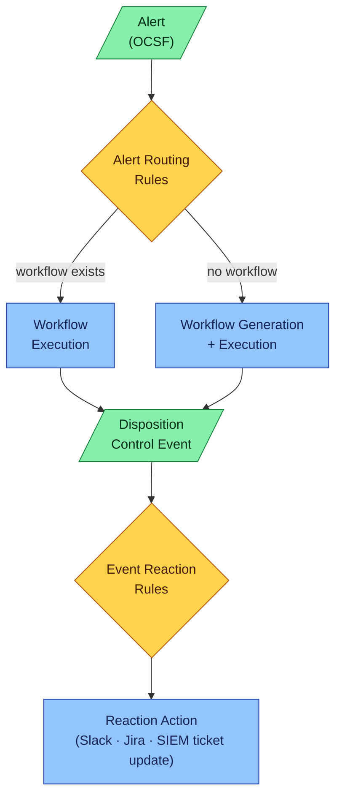

# Alert lifecycle

The path an alert takes from ingestion to reaction is rule-driven on both ends. Shape vocabulary used below:

- **Parallelogram** — data / event flowing through the system
- **Diamond** — rule engine / decision logic
- **Rectangle** — function / executable step



## Two rule engines, very different sources

Two rule engines bracket the agentic core, but they look alike only on the surface — they're populated and matched very differently:

- **Alert Routing Rules** are **auto-generated**, never hand-written. Each rule says "alerts produced by *this detection rule* run *this workflow*". They appear in the database as a side effect of workflow generation: when Analysi synthesizes a workflow for a never-before-seen detection rule, it also writes the routing rule that pins future alerts of the same rule to that workflow. At steady state there is one routing rule per detection rule the system has ever processed.
- **Event Reaction Rules** are **user-configured**. Each rule matches on properties of the disposition control event (verdict, severity, tags, source, etc.) and fans out to side-effects: post to Slack, open a Jira ticket, update the SIEM case, page on-call, etc. The same disposition can fire any number of reactions — and different teams or environments can configure their own.

## From OCSF alert to detection rule

The "detection rule" the routing engine keys on is extracted from the OCSF Detection Finding event during ingestion:

```
ocsf.finding_info.analytic.name   →   Alert.rule_name
```

(See [`src/analysi/integrations/framework/alert_ingest.py:175`](https://github.com/open-analysi/analysi-app/blob/main/src/analysi/integrations/framework/alert_ingest.py#L175).) The `rule_name` becomes the unique `title` of an `AnalysisGroup` row ([`src/analysi/models/kea_coordination.py:25`](https://github.com/open-analysi/analysi-app/blob/main/src/analysi/models/kea_coordination.py#L25)), which the `AlertRoutingRule` table maps to a `workflow_id` ([`src/analysi/models/kea_coordination.py:140`](https://github.com/open-analysi/analysi-app/blob/main/src/analysi/models/kea_coordination.py#L140)). Routing for a new alert is therefore one lookup: `finding_info.analytic.name` → analysis group → routing rule → workflow.

If the lookup misses (no analysis group, or no routing rule yet), the alert is queued for workflow generation. Once generation completes successfully, both the analysis group and the routing rule exist, and every subsequent alert from the same detection rule takes the cheap path.
