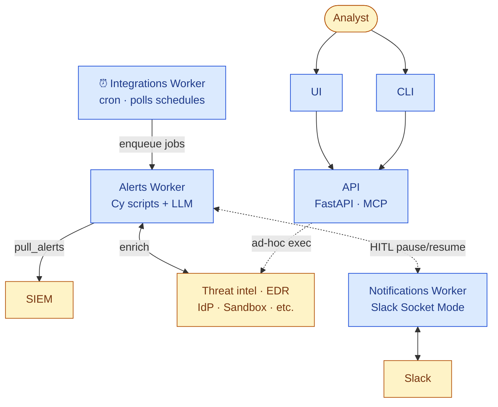

# Component architecture

The runtime processes that implement the [concept](concept.md) and [lifecycle](alert-lifecycle.md), and the wires between them:

> The `IW → AW` arrow is mediated by **Valkey** (ARQ queue). All services share **Postgres** for state, **Vault** for credentials, and **MinIO** for artifacts; the API uses **Keycloak** for OIDC. See the service table below.

## Services

| Service | Purpose |
|---------|---------|
| **API** | REST API (FastAPI), MCP server, serves UI and external clients |
| **Alerts Worker** | Alert analysis pipeline — triage, workflow generation, enrichment, disposition |
| **Integrations Worker** | Schedule dispatcher — polls the `schedules` table and enqueues jobs (pull alerts, health checks) onto the alerts worker; ad-hoc tool execution runs in-process in the API |
| **Notifications Worker** | Slack Socket Mode listener for human-in-the-loop interactions |
| **UI** | Frontend application |
| **CLI** | TypeScript CLI over the REST API |
| **PostgreSQL** | Primary data store (pg_partman for partitioned tables, pg_cron for maintenance) |
| **Valkey** | Job queue (ARQ) and caching (Redis-compatible) |
| **Vault** | Credential encryption (Transit engine) |
| **MinIO** | Artifact storage (S3-compatible) |
| **Keycloak** | Identity provider (OIDC, RBAC) |
