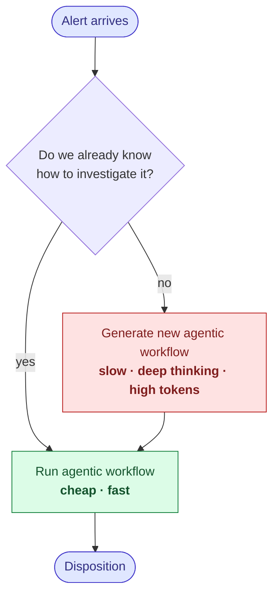

# Concept

Every alert in a SIEM/EDR is produced by a **detection rule** (e.g. Splunk's "Suspicious PowerShell Execution"). Analysi keys its investigation knowledge to the rule, not the individual alert — at most one agentic workflow per rule.

The first time a rule fires, Analysi has no workflow for it and synthesizes one autonomously: slow, token-heavy, multi-tool reasoning. The result is saved against the rule. Every subsequent alert from that same rule reuses the saved workflow — cheap and fast.

At steady state, the system holds **one agentic workflow per detection rule that has ever fired** in the environment. As rule coverage grows, the rate of expensive synthesis trends toward zero — and the cost of investigating each new alert collapses to the price of replaying a saved workflow.
