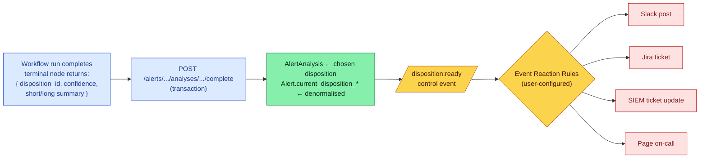

# Disposition

A **Disposition** is the verdict an investigation produces — *what kind of thing* the alert turned out to be, with a priority. It is the bridge between the agentic core (Workflows) and the side-effects layer (Event Reaction Rules from [Alert lifecycle](alert-lifecycle.md)).

## Four layers

The word "disposition" shows up in four distinct places. Match the meaning to the layer:

| Layer | Where | Purpose |
|-------|-------|---------|
| 1. Catalog | `dispositions` table — [`models/alert.py:318`](https://github.com/open-analysi/analysi-app/blob/main/src/analysi/models/alert.py#L318) | The set of categories an investigation can pick from |
| 2. Pick | `AlertAnalysis.disposition_id` — [`models/alert.py:230`](https://github.com/open-analysi/analysi-app/blob/main/src/analysi/models/alert.py#L230) | The catalog row this analysis chose |
| 3. Denormalisation | `Alert.current_disposition_*` columns | Cached on the alert for fast list/filter views |
| 4. Fan-out signal | `disposition:ready` control event — [`routers/alerts.py:765`](https://github.com/open-analysi/analysi-app/blob/main/src/analysi/routers/alerts.py#L765) | Triggers Event Reaction Rules (Slack, Jira, SIEM update, page on-call) |

## The catalog (`dispositions` table)

Each row in `dispositions` is `(category, subcategory)` — uniquely constrained — plus presentation and policy metadata:

| Column | Purpose |
|--------|---------|
| `category` / `subcategory` | The verdict — the unique key analysts and rules match on |
| `display_name` | Human-readable label for UI / Slack / tickets |
| `color_hex` / `color_name` | Visualisation (severity ribbon, kanban swim-lanes) |
| `priority_score` | Integer 1–10, **1 is highest** (per the model comment) |
| `description` | Long-form explanation |
| `requires_escalation` | Policy hint — reactions can key off this |
| `is_system` | `true` for catalog rows shipped with Analysi; `false` for tenant-added rows |

The catalog is curated, not free-form: a workflow doesn't invent a category — it picks one of the rows by id.

## How an analysis chooses one

A workflow's terminal node produces a payload that includes a `disposition_id` (and the denormalised display fields used by the alert list). The analysis-completion endpoint applies it transactionally ([`routers/alerts.py:719`](https://github.com/open-analysi/analysi-app/blob/main/src/analysi/routers/alerts.py#L719)):

1. Idempotency guard — `emit_disposition_ready = analysis.status != "completed"`. Re-completing an already-completed analysis is a no-op for the event bus.
2. Update `AlertAnalysis`: `disposition_id`, `confidence` (0–100), `short_summary`, `long_summary`, `status = "completed"`, `completed_at`.
3. Update the parent `Alert` row's denormalised columns — `current_disposition_category`, `current_disposition_subcategory`, `current_disposition_display_name`, `current_disposition_confidence`, `analysis_status = "completed"`. This makes alert lists filterable by disposition without a join.
4. Insert a `disposition:ready` control event in the same transaction:

   ```json
   {
     "channel": "disposition:ready",
     "payload": {
       "alert_id": "…",
       "analysis_id": "…",
       "disposition_id": "…",
       "disposition_display_name": "…",
       "confidence": 87
     }
   }
   ```

The transaction is the durability boundary — either the analysis is marked complete *and* the event is queued, or neither happens.

## The fan-out

Once `disposition:ready` is on the bus, **Event Reaction Rules** match against it and dispatch side-effects. Reaction rules are user-configured (one rule fires zero, one, or many actions; multiple rules can match the same event). See the [Alert lifecycle](alert-lifecycle.md#two-rule-engines-very-different-sources) page for the user-configured-vs-auto-generated distinction between the two rule engines.



## Where to go next

- **What writes the disposition?** A [Workflow](workflows.md) — typically a terminal Task node that composes the disposition payload from accumulated enrichments.
- **What consumes the event?** Reaction rules — see [Alert lifecycle § Two rule engines](alert-lifecycle.md#two-rule-engines-very-different-sources) and the catalog of [Integrations](../reference/integrations.md) that side-effects can target.
- **Field reference**: [Terminology — Alerts and detection](../reference/terminology.md#alerts-and-detection).
