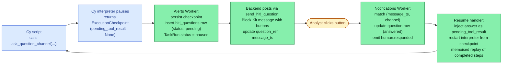

# Human-in-the-loop

Some investigation steps cannot be decided by automation alone — "should we escalate this user lockout?", "approve this remediation?", "which of these three IPs is actually the suspect?". **Human-in-the-loop (HITL)** is the mechanism that lets a workflow pause at exactly that point, post a question to Slack, and resume — with the human's answer threaded back into the script — when the analyst clicks a button.

The mechanism is built on the [Cy language](cy-language.md)'s pause/resume primitive: a tool registered with `hi_latency: True` causes the interpreter to suspend, returning a checkpoint the host stores. This page covers what Analysi adds — the Slack delivery layer, three-layer pause propagation, memoised replay, and timeouts.

Source: [`chat/skills/hitl.md`](https://github.com/open-analysi/analysi-app/blob/main/src/analysi/chat/skills/hitl.md), [`models/hitl_question.py`](https://github.com/open-analysi/analysi-app/blob/main/src/analysi/models/hitl_question.py), [`slack_listener/`](https://github.com/open-analysi/analysi-app/tree/main/src/analysi/slack_listener), [`alert_analysis/jobs/control_events.py`](https://github.com/open-analysi/analysi-app/blob/main/src/analysi/alert_analysis/jobs/control_events.py).

## The three Slack tools

The Slack integration declares three actions with `hi_latency: true` in its [`manifest.json`](https://github.com/open-analysi/analysi-app/blob/main/src/analysi/integrations/framework/integrations/slack/manifest.json). Calling any of them from a Cy script triggers the pause:

| Cy call | Required params | Effect |
|---------|------------------|--------|
| `app::slack::ask_question(destination, question)` | `destination`, `question` | DM a Slack user |
| `app::slack::ask_question_channel(destination, question, responses?)` | `destination`, `question` (`responses` is comma-separated button labels, max 5) | Post in a channel with optional buttons |
| `app::slack::get_response(question_id)` | `question_id` | Wait for the response to a previously-asked question |

The hi-latency tool **never executes**. At pause time, `pending_tool_result` is `None`. The backend takes over delivery — see the flow below.

## Pause and resume



Two non-obvious details:

- **The hi-latency tool entry is purely a marker.** The Cy registration for `app::slack::ask_question_channel` is the dict form `{"fn": wrapper, "hi_latency": True}` ([`task_execution.py:1314`](https://github.com/open-analysi/analysi-app/blob/main/src/analysi/services/task_execution.py#L1314)) — when the interpreter sees `hi_latency: True`, it captures the pending call args into a checkpoint and raises `ExecutionPaused` *without* invoking `wrapper`. The backend posts to Slack itself.
- **Resume is memoised.** The `ExecutionCheckpoint` stores `node_results`, `pending_tool_args`, and `variables`. On resume, completed steps replay from cache — the LLM is not re-invoked for steps that already succeeded. Resume is fast and deterministic.

## Three-layer pause propagation

A pause never stops at the Cy interpreter. It propagates upward through every layer that's currently waiting on the script ([`chat/skills/hitl.md`](https://github.com/open-analysi/analysi-app/blob/main/src/analysi/chat/skills/hitl.md)):

| Layer | Status while paused | Constant |
|-------|---------------------|----------|
| `TaskRun` | `paused` | `TaskConstants.Status.PAUSED` ([`constants.py:32`](https://github.com/open-analysi/analysi-app/blob/main/src/analysi/constants.py#L32)) |
| `WorkflowNodeInstance` (if Task is in a workflow) | `paused` | `WorkflowConstants.Status.PAUSED` ([`constants.py:63`](https://github.com/open-analysi/analysi-app/blob/main/src/analysi/constants.py#L63)) |
| `AlertAnalysis` (if workflow is in an alert pipeline) | `paused_human_review` | [`alert_analysis/jobs/control_events.py:636`](https://github.com/open-analysi/analysi-app/blob/main/src/analysi/alert_analysis/jobs/control_events.py#L636) |

This guarantees that no upstream process tries to finalise results while a question is outstanding. Resume reverses all three.

## The `human:responded` control event

When the analyst clicks a button, the [Notifications Worker](component-architecture.md) (running Slack Socket Mode) matches the click to a pending question by `(message_ts, channel_id) = (question_ref, channel)`, marks the question `answered`, and emits a control event:

```
channel: human:responded
payload: { question_id, answer, answered_by, ... }
```

The constant is `HITLQuestionConstants.CHANNEL_HUMAN_RESPONDED` ([`constants.py:78`](https://github.com/open-analysi/analysi-app/blob/main/src/analysi/constants.py#L78)). The control-event consumer dispatches to the resume handler at [`alert_analysis/jobs/control_events.py:770`](https://github.com/open-analysi/analysi-app/blob/main/src/analysi/alert_analysis/jobs/control_events.py#L770), which loads the checkpoint, injects `pending_tool_result = answer`, and re-runs the Cy interpreter via `TaskExecutionService.execute`.

## The `hitl_questions` table

Each pause creates a row tracked through its lifecycle. The table is monthly-partitioned by `created_at`. Key columns ([`models/hitl_question.py`](https://github.com/open-analysi/analysi-app/blob/main/src/analysi/models/hitl_question.py)):

| Column | Purpose |
|--------|---------|
| `tenant_id` | Multi-tenant isolation |
| `question_ref` | Slack `message_ts` (set after the message is posted) |
| `channel` | Slack channel ID |
| `question_text`, `options` | What was asked, what buttons were offered |
| `status` | `pending` → `answered` \| `expired` ([`HITLQuestionConstants.Status`](https://github.com/open-analysi/analysi-app/blob/main/src/analysi/constants.py#L69)) |
| `answer`, `answered_by`, `answered_at` | The reply, the Slack user who clicked, the timestamp |
| `timeout_at` | Deadline — default `now() + 4 hours` (`HITLQuestionConstants.DEFAULT_TIMEOUT_HOURS`) |
| `task_run_id`, `workflow_run_id`, `node_instance_id`, `analysis_id` | Links back to the paused execution (no FKs because the target tables are partitioned) |

## Timeout

A reconciliation cron runs every 10 seconds ([`alert_analysis/jobs/reconciliation.py`](https://github.com/open-analysi/analysi-app/blob/main/src/analysi/alert_analysis/jobs/reconciliation.py)). It finds `pending` questions whose `timeout_at < now()`, marks them `expired`, and fails the associated `TaskRun` / `WorkflowNodeInstance` / `AlertAnalysis` with an explanatory error message. The default 4-hour timeout is configurable per-question.

## Audit trail

Every answer is logged as an `hitl.question_answered` activity event (`HITLQuestionConstants.AUDIT_ACTION_ANSWERED` — [`constants.py:81`](https://github.com/open-analysi/analysi-app/blob/main/src/analysi/constants.py#L81)) capturing who answered, what they answered, and when. This feeds the same activity audit trail used for compliance and investigation review.

## Where to go next

- **Authoring**: the `app::slack::*` tools are documented above; for the upstream Cy pause primitive see the [cy-language pause/resume docs](https://github.com/open-analysi/cy-language#pause-and-resume).
- **Where pauses fit**: a paused [Task](tasks.md#taskrun-lifecycle) inside a paused [Workflow](workflows.md#run-lifecycle) inside a paused alert analysis.
- **Future delivery channels**: only Slack is supported today. Microsoft Teams support is mentioned as planned in the chat skill.
