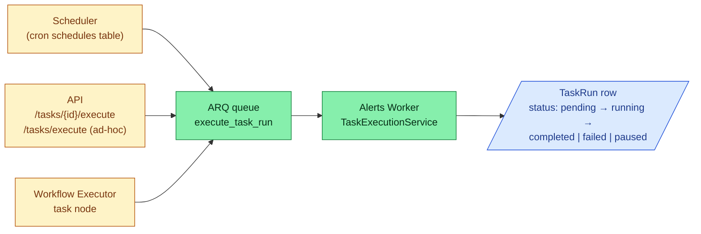

# Tasks

A **Task** is the smallest reusable unit of investigation in Analysi. Concretely it is a saved [Cy script](cy-language.md) plus the metadata needed to call it, schedule it, validate it, and embed it in a [Workflow](workflows.md).

Source: [`models/task.py:27`](https://github.com/open-analysi/analysi-app/blob/main/src/analysi/models/task.py#L27).

## Anatomy

The `tasks` table stores the script and configuration; identity and lifecycle live on the parent `Component` row (`Task.component_id` is the FK to `components.id`, which is also the ID workflows use to reference the Task).

| Column | Purpose | Notes |
|--------|---------|-------|
| `script` | The Cy source code | Optional — Tasks of `function = "summarization"`/`"reasoning"` etc. may delegate to a built-in handler instead of authoring Cy |
| `directive` | Free-text instruction passed to LLM-style functions | |
| `function` | Categorization of what the Task does | One of `summarization`, `data_conversion`, `extraction`, `reasoning`, `planning`, `visualization`, `search` ([`constants.py:241`](https://github.com/open-analysi/analysi-app/blob/main/src/analysi/constants.py#L241)) |
| `scope` | Where the Task fits in the alert pipeline | `input` / `processing` / `output` ([`constants.py:253`](https://github.com/open-analysi/analysi-app/blob/main/src/analysi/constants.py#L253)) — default `processing` |
| `mode` | `saved` (callable by FQN/ID, reusable) or `ad_hoc` (one-shot, no parent Task row) | [`constants.py:261`](https://github.com/open-analysi/analysi-app/blob/main/src/analysi/constants.py#L261) |
| `data_samples` | JSONB list of example inputs | Used by validation and type-propagation tooling |
| `llm_config` | LLM provider/model/parameters as JSONB | Consumed by `llm_run` and friends inside the script |
| `schedule` | Optional cron expression | Picked up by the scheduler and dispatched to the Alerts Worker |
| `integration_id` | Optional link to a specific Integration | Used when the Task is bound to one connector |
| `origin_type` | `system` / `user` / `pack` | Where the Task came from — `pack` rows arrive via `analysi packs install` |
| `managed_resource_key` | Marker for system-managed Tasks | E.g. `alert_ingestion`, `health_check` ([`constants.py:43`](https://github.com/open-analysi/analysi-app/blob/main/src/analysi/constants.py#L43)) |

A Task's IO contract is expressed by the schemas on the `Component` row plus its `data_samples`; type checking and propagation use those when the Task is dropped into a workflow ([`services/type_propagation/propagator.py`](https://github.com/open-analysi/analysi-app/blob/main/src/analysi/services/type_propagation/propagator.py)).

## How a Task runs

Every execution — whether scheduled, ad-hoc, or as part of a workflow — produces a `TaskRun` row ([`models/task_run.py:23`](https://github.com/open-analysi/analysi-app/blob/main/src/analysi/models/task_run.py#L23)). The execution is enqueued as the ARQ job `analysi.jobs.task_run_job.execute_task_run` and consumed by the Alerts Worker ([`alert_analysis/worker.py:67`](https://github.com/open-analysi/analysi-app/blob/main/src/analysi/alert_analysis/worker.py#L67)). The worker resolves the script (from the saved Task or, for ad-hoc runs, from `TaskRun.cy_script`), constructs a Cy interpreter (see [Cy in Analysi](cy-language.md#where-cy-runs)), and runs it.

### Three callers, one execution path

- **Scheduled.** A `Schedule` row with `target_type=task` and `next_run_at` is polled by the integrations worker; when due, a `JobRun` is created and the task_run job is enqueued. ([Terminology — Schedule](../reference/terminology.md#execution-records).)
- **Ad-hoc.** API or MCP clients can POST a Cy script (and optional `input_data`) to the execution endpoint. The TaskRun row carries the script in `cy_script` and has `task_id = NULL`. The MCP `execute_cy_script_adhoc` tool ([`mcp/tools/cy_tools.py:405`](https://github.com/open-analysi/analysi-app/blob/main/src/analysi/mcp/tools/cy_tools.py#L405)) is the same path with MCP auth.
- **Workflow node.** A Task node in a workflow creates its TaskRun via `TaskRunService.create_execution`, with `workflow_run_id` and `workflow_node_instance_id` populated ([`services/workflow_execution.py:294`](https://github.com/open-analysi/analysi-app/blob/main/src/analysi/services/workflow_execution.py#L294)). The Task script's `input` variable is the upstream envelope's `result` field — see [Workflows](workflows.md#how-data-flows-between-nodes).

## TaskRun lifecycle

Statuses are defined by `TaskConstants.Status` ([`constants.py:27`](https://github.com/open-analysi/analysi-app/blob/main/src/analysi/constants.py#L27)):

| Status | Meaning |
|--------|---------|
| `pending` | Created but not yet picked up by a worker |
| `running` | Worker has the run; default state once execution begins (model default is `running` — [`task_run.py:48`](https://github.com/open-analysi/analysi-app/blob/main/src/analysi/models/task_run.py#L48)) |
| `completed` | Script returned successfully |
| `failed` | Script raised, or output validation failed |
| `paused` | Cy interpreter hit a `hi_latency` tool — see [Human-in-the-loop](hitl.md) |

When a TaskRun pauses, the pause propagates to any parent `WorkflowNodeInstance` and `AlertAnalysis` ([`chat/skills/hitl.md`](https://github.com/open-analysi/analysi-app/blob/main/src/analysi/chat/skills/hitl.md)). Resume is driven by the `human:responded` control event and replays completed steps from a memoized checkpoint.

## Storage of inputs and outputs

`TaskRun` stores inputs and outputs out-of-band so the row stays small and partitioning works:

- `input_type` / `input_location`: `inline` (small payloads stored directly in `input_location`), `s3` (object key in MinIO), or `file`
- `output_type` / `output_location`: same convention
- The same scheme is used by `WorkflowRun` and `WorkflowNodeInstance` ([`models/workflow_execution.py`](https://github.com/open-analysi/analysi-app/blob/main/src/analysi/models/workflow_execution.py))

The `task_runs` table is partitioned by `created_at` (daily); default retention is 90 days, configurable via Helm.

## Where to go next

- **Author a Task**: see the [Cy language tutorial](https://github.com/open-analysi/cy-language/blob/main/docs/TUTORIAL.md) and [Cy in Analysi](cy-language.md) for the registered tool surface.
- **Compose Tasks into a workflow**: [Workflows](workflows.md).
- **Field reference**: [Terminology — Investigation primitives](../reference/terminology.md#investigation-primitives).
