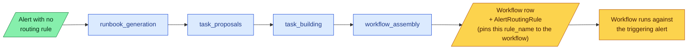

# Workflow generation

The first time Analysi sees an alert from a detection rule it has never processed, there is no workflow to run. **Workflow generation** is the cold-path branch from the [Alert lifecycle](alert-lifecycle.md) — the slow, token-heavy, deep-thinking step that synthesises a workflow for that detection rule, persists it, and writes the [Alert Routing Rule](../reference/terminology.md#events-and-rules) that pins all subsequent alerts from the same rule to the cheap path.

This is the mechanism behind the [Concept](concept.md) page's claim that "the rate of expensive synthesis trends toward zero" — generation runs **once per detection rule**, then never again unless explicitly re-triggered.

## When it fires

Routing for a new alert is a single lookup: `finding_info.analytic.name → AnalysisGroup → AlertRoutingRule → workflow_id` (see [Alert lifecycle § From OCSF alert to detection rule](alert-lifecycle.md#from-ocsf-alert-to-detection-rule)). If the lookup misses — no `AnalysisGroup` row, or no routing rule yet — the alert is queued for generation. The ARQ job is `analysi.agentic_orchestration.jobs.workflow_generation_job.execute_workflow_generation`, registered on the Alerts Worker ([`alert_analysis/worker.py:63`](https://github.com/open-analysi/analysi-app/blob/main/src/analysi/alert_analysis/worker.py#L63)).

Each run is tracked by a `WorkflowGeneration` row ([`models/kea_coordination.py:59`](https://github.com/open-analysi/analysi-app/blob/main/src/analysi/models/kea_coordination.py#L59)) linked to the `AnalysisGroup` (the per-detection-rule grouping) and to the alert that triggered it (`triggering_alert_analysis_id`). Status is one of `running`, `completed`, `failed` ([`schemas/kea_coordination.py:12`](https://github.com/open-analysi/analysi-app/blob/main/src/analysi/schemas/kea_coordination.py#L12)).

## The four stages

Generation is a fixed sequence of four stages ([`schemas/kea_coordination.py:18`](https://github.com/open-analysi/analysi-app/blob/main/src/analysi/schemas/kea_coordination.py#L18) — `WORKFLOW_STAGES`):

| Stage | Purpose |
|-------|---------|
| `runbook_generation` | Drafts an investigation runbook for this detection rule by reasoning over installed Skills, the alert sample, and prior knowledge — the human-readable plan |
| `task_proposals` | Decomposes the runbook into a list of proposed [Tasks](tasks.md), reusing existing Tasks where they fit and proposing new ones where they don't |
| `task_building` | Builds (or reuses) each proposed Task — the Cy script, IO schemas, and `data_samples` — calling `task_build_job` per Task |
| `workflow_assembly` | Wires the built Tasks into a [Workflow](workflows.md) DAG, validates type propagation, and persists the `Workflow`, its routing rule, and the `WorkflowGeneration` outcome |

Progress is written incrementally to `WorkflowGeneration.current_phase` (JSONB) by a `DatabaseProgressCallback` injected by the job layer ([`workflow_generation_job.py`](https://github.com/open-analysi/analysi-app/blob/main/src/analysi/agentic_orchestration/jobs/workflow_generation_job.py)). The orchestration code itself is dependency-injected and **never** calls the database directly — see the architecture rule in [`agentic_orchestration/CLAUDE.md`](https://github.com/open-analysi/analysi-app/blob/main/src/analysi/agentic_orchestration/CLAUDE.md).

## The orchestrator

The driver is `run_orchestration_with_stages` in [`agentic_orchestration/orchestrator.py:228`](https://github.com/open-analysi/analysi-app/blob/main/src/analysi/agentic_orchestration/orchestrator.py#L228). It composes the four stages over an `AgentOrchestrationExecutor` — a wrapper around the Claude Agent SDK that runs file-based agents with a tightly-scoped tool allowlist (`Write`, `Read`, `Glob`, `Grep`, `Skill`, `Task`, `mcp__analysi__*`). The runbook stage has an alternative LangGraph implementation gated behind `ANALYSI_USE_LANGGRAPH_PHASE1`.

The orchestrator's outputs land in `WorkflowGeneration.orchestration_results` (JSONB) — a single field that holds the runbook, task proposals, built tasks, the workflow composition, metrics, and any error. This is the audit trail for "why did the planner pick *this* DAG?".

## What gets written at success

When `workflow_assembly` completes successfully:

1. A `Workflow` row exists with `is_dynamic = true` (see [Workflows § Blueprint vs run](workflows.md#blueprint-vs-run)).
2. An `AlertRoutingRule` row maps the `AnalysisGroup` (= detection rule) to the new `workflow_id` ([`models/kea_coordination.py:140`](https://github.com/open-analysi/analysi-app/blob/main/src/analysi/models/kea_coordination.py#L140)).
3. `WorkflowGeneration.workflow_id` is populated, `status = "completed"`, `completed_at` is set, `is_active = true`.
4. The triggering alert is then run through the new workflow on the cheap path.

From this moment forward, every alert with the same `rule_name` skips generation entirely.

## Failure and retry

If generation fails, `WorkflowGeneration.status = "failed"` and the failure metadata lives in `orchestration_results`. The triggering `AlertAnalysis` records retry counters — `workflow_gen_retry_count` and `workflow_gen_last_failure_at` ([`models/alert.py:242`](https://github.com/open-analysi/analysi-app/blob/main/src/analysi/models/alert.py#L242)) — used to gate re-attempts under whatever policy `AlertAnalysisConfig` is set to.

## Where to go next

- **Triggering pipeline**: see [Alert lifecycle](alert-lifecycle.md) — the cold-path arrow leads here, the warm-path arrow runs the existing workflow.
- **What gets generated**: the structures are [Tasks](tasks.md) (Cy script + schemas) wired into a [Workflow](workflows.md) (DAG + envelope flow).
- **Field reference**: [Terminology — Events and rules](../reference/terminology.md#events-and-rules) for `AnalysisGroup` and `AlertRoutingRule`.
