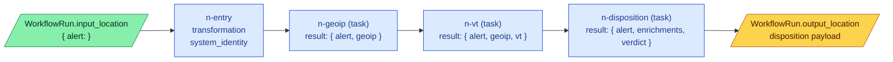
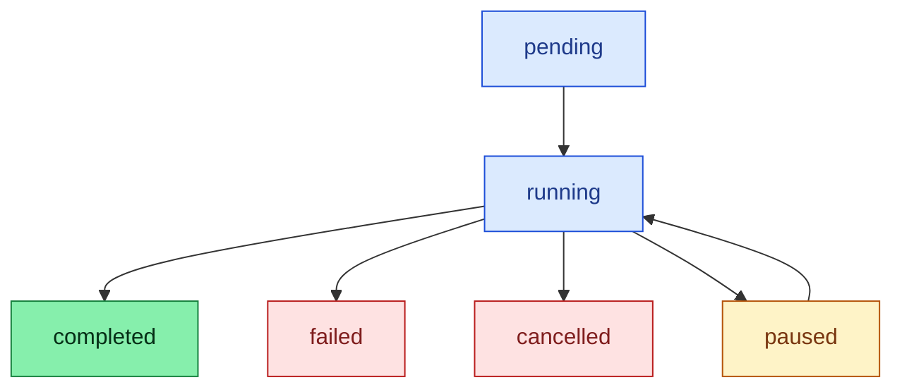

# Workflows

A **Workflow** is a directed acyclic graph (DAG) of [Tasks](tasks.md) and helper nodes that turns an input — usually an alert — into an output — usually a disposition payload plus accumulated enrichments. It is the unit Analysi auto-generates per detection rule and replays on every subsequent alert from the same rule (see [Concept](concept.md) and [Alert lifecycle](alert-lifecycle.md)).

Source: [`models/workflow.py:30`](https://github.com/open-analysi/analysi-app/blob/main/src/analysi/models/workflow.py#L30) (blueprint), [`models/workflow_execution.py:17`](https://github.com/open-analysi/analysi-app/blob/main/src/analysi/models/workflow_execution.py#L17) (run), [`services/workflow_execution.py`](https://github.com/open-analysi/analysi-app/blob/main/src/analysi/services/workflow_execution.py) (executor).

## Blueprint vs. run

| Layer | Table | What it stores |
|-------|-------|----------------|
| Blueprint | `workflows`, `workflow_nodes`, `workflow_edges` | The DAG, schemas, validation status (`draft` / `validated` / `invalid`), `is_dynamic`, `is_ephemeral`/`expires_at` |
| Run | `workflow_runs`, `workflow_node_instances`, `workflow_edge_instances` | One execution: the input that was provided, the per-node instance state, the data delivered along each edge — all partitioned by `created_at` |

A workflow can be replayed any number of times. Each execution is its own `WorkflowRun` (status default `pending`, transitions to `running`, then `completed` / `failed` / `cancelled` / `paused` — `WorkflowConstants.Status` at [`constants.py:57`](https://github.com/open-analysi/analysi-app/blob/main/src/analysi/constants.py#L57)).

## Workflow IO contract

Every workflow declares an `io_schema` (JSONB on `Workflow.io_schema`) with `input` and `output` JSON Schemas, plus `data_samples` that must validate against `io_schema.input`. From [`chat/skills/workflows.md`](https://github.com/open-analysi/analysi-app/blob/main/src/analysi/chat/skills/workflows.md): bare `{"type": "object"}` is rejected — the input must specify `properties` and `required`.

For alert-investigation workflows the input is conventionally `{ alert: <OCSF Detection Finding> }` and the output is the enriched payload that becomes the disposition. The platform doesn't enforce that shape — `io_schema` declares it and validation enforces it per-workflow.

## Node kinds

Three kinds are implemented in the executor today (validated at [`services/workflow.py:1255`](https://github.com/open-analysi/analysi-app/blob/main/src/analysi/services/workflow.py#L1255); any other `kind` is rejected):

| Kind | What it does | Required schemas | Where executed |
|------|--------------|------------------|----------------|
| `task` | Runs a saved Task — the node's `task_id` references the Task's `component_id` | `input`, `output` | TaskExecutionService on the Alerts Worker ([`workflow_execution.py:261`](https://github.com/open-analysi/analysi-app/blob/main/src/analysi/services/workflow_execution.py#L261)) |
| `transformation` | Runs a `NodeTemplate` (Python code) for projection / shaping | `input`, `output_envelope`, `output_result` | In-process in the workflow executor ([`workflow_execution.py:416`](https://github.com/open-analysi/analysi-app/blob/main/src/analysi/services/workflow_execution.py#L416)) |
| `foreach` | Iterates an array, fans out child instances per item, aggregates | `input`, `output` | In-process in the workflow executor; uses `foreach_config` and tracks per-child state in `WorkflowNodeInstance.parent_instance_id` / `loop_context` |

Three system templates are pre-installed for transformation nodes ([`chat/skills/workflows.md`](https://github.com/open-analysi/analysi-app/blob/main/src/analysi/chat/skills/workflows.md)):

| Template UUID | Name | Use |
|---------------|------|-----|
| `00000000-0000-0000-0000-000000000001` | `system_identity` | Passthrough — typical entry node, distributes the workflow input downstream |
| `00000000-0000-0000-0000-000000000002` | `system_merge` | Merges multiple inputs into one object (fan-in) |
| `00000000-0000-0000-0000-000000000003` | `system_collect` | Collects multiple inputs into an array (used before/after foreach) |

Every workflow must have exactly one entry node — `is_start_node = True` — and it must be a `task` or `transformation` node ([`models/workflow.py:494`](https://github.com/open-analysi/analysi-app/blob/main/src/analysi/models/workflow.py#L494)).

Switch / aggregation / filter nodes are described in the internal spec as future work; they are not implemented in the executor today.

## The envelope

This is the data plane. Every node emits a JSON object of this exact shape ([`services/workflow_execution.py:65`](https://github.com/open-analysi/analysi-app/blob/main/src/analysi/services/workflow_execution.py#L65) — `_build_task_output_envelope`):

```json
{
  "node_id": "n-geoip",
  "context": { "llm_usage": { "input_tokens": 0, "output_tokens": 0, "total_tokens": 0, "cost_usd": null } },
  "description": "Output from task execution",
  "result": { "ip": "8.8.8.8", "country": "US", "asn": 15169 }
}
```

- **`result`** — the payload the next node will read. This is where enrichments live.
- **`node_id`** — which node produced it (used for tracing; downstream nodes do not normally key off it).
- **`context`** — node-level metadata. Today this is populated with `llm_usage` for Task nodes that called LLM functions; the executor aggregates it into `WorkflowRun.execution_context["_llm_usage"]` at completion ([`models/workflow_execution.py:74`](https://github.com/open-analysi/analysi-app/blob/main/src/analysi/models/workflow_execution.py#L74)).
- **`description`** — human-readable label.

Schemas validate `result` (via the node's `output_result` schema for transformation nodes) and the surrounding envelope (via `output_envelope`) separately, so error messages can say "envelope is fine, result violated its schema" or vice versa.

## How data flows between nodes

The executor's [`aggregate_predecessor_outputs`](https://github.com/open-analysi/analysi-app/blob/main/src/analysi/services/workflow_execution.py#L640) builds the input each node sees. Three cases:

### 1. No predecessors (entry node)

The executor reads `WorkflowRun.input_location` (inline JSON or S3) and returns it as-is. This is the workflow input — typically the `{ alert: ... }` payload. The entry node receives it directly.

### 2. Single predecessor

The executor unwraps the upstream envelope's `result`, then re-wraps it in a fresh envelope for the consumer:

```json
{ "node_id": "single-n-geoip", "context": {}, "description": "Single predecessor result from n-geoip", "result": <upstream result> }
```

### 3. Multiple predecessors (fan-in)

The executor pulls each predecessor's `result`, drops the surrounding envelope, and returns an aggregated envelope whose `result` is the array of upstream results in topological order:

```json
{ "node_id": "aggregation-n-merge", "context": {}, "description": "Fan-in aggregation of 3 predecessors", "result": [<r1>, <r2>, <r3>] }
```

### What each node kind sees

- **Task nodes** receive `input_data["result"]` as the Cy script's `input` variable ([`workflow_execution.py:271`](https://github.com/open-analysi/analysi-app/blob/main/src/analysi/services/workflow_execution.py#L271)). The full envelope is stripped — Cy scripts only see `result`.
- **Transformation nodes** receive `inp = input_data["result"]` by default; the full envelope is also passed as `workflow_input` so templates that need `context` can opt in ([`workflow_execution.py:447`](https://github.com/open-analysi/analysi-app/blob/main/src/analysi/services/workflow_execution.py#L447)).

## Alert in, enriched alert out

The "enrichment accumulation" pattern users care about is built from the primitives above — the platform does not maintain a hidden "growing alert" object. The pattern is:



Each enrichment node reads `input` (= upstream `result`), calls one or more integration actions (e.g. `app::virustotal::ip_reputation` — see [Integrations catalog](../reference/integrations.md)), and returns a `result` that re-emits the upstream payload **plus** its new fields. The "enriched alert" is built up by the script authors choosing to forward what they received and add to it. A final node typically composes the disposition payload from the accumulated state. The workflow's overall output is whatever the terminal node(s) return, persisted on `WorkflowRun.output_location`.

For fan-out across a list (e.g. enriching every IP in the alert), `foreach` spawns a child `WorkflowNodeInstance` per item with `parent_instance_id` and `loop_context = { item_index, item_key, total_items }`. Children are typically followed by a `system_collect` transformation that aggregates their results back into an array.

## Run lifecycle



Execution is driven by the ARQ job `analysi.jobs.workflow_run_job.execute_workflow_run` ([`jobs/workflow_run_job.py`](https://github.com/open-analysi/analysi-app/blob/main/src/analysi/jobs/workflow_run_job.py)) which calls `WorkflowExecutor._execute_workflow_synchronously`. The executor walks the DAG in topological order, creates a `WorkflowNodeInstance` per node, drives Task nodes through `TaskExecutionService`, and writes a `WorkflowEdgeInstance` for every delivered edge so the execution can be visualised after the fact.

A `paused` state arises when a Task node's Cy script hits a `hi_latency` tool (see [Human-in-the-loop](hitl.md)). The pause propagates upward to the `WorkflowNodeInstance` and — if the workflow is part of an alert analysis — to `AlertAnalysis.status = "paused_human_review"`. Resume is driven by the `human:responded` control event and replays already-completed nodes from the memoized checkpoint.

## Validation

A workflow is created in `status = "draft"` and transitions to `validated` or `invalid` on demand. Validation does four things ([`chat/skills/workflows.md`](https://github.com/open-analysi/analysi-app/blob/main/src/analysi/chat/skills/workflows.md)):

1. DAG check — DFS for cycles.
2. Entry node check — exactly one `is_start_node = True`, kind in `{task, transformation}`.
3. Type propagation — input types flow forward through the graph; mismatches are reported as warnings or errors. Each node's `schemas` JSONB stores `inferred_input`, `inferred_output`, `type_checked`, `validated_at`.
4. Data-sample validation — `data_samples` validated against `io_schema.input`.

## Where to go next

- **Author a workflow with one call**: the `compose` API takes an array of Task `cy_name`s and wires the DAG — see [`chat/skills/workflows.md`](https://github.com/open-analysi/analysi-app/blob/main/src/analysi/chat/skills/workflows.md).
- **Inspect a run**: the execution-graph endpoint returns node + edge instances with status, timing, and IO locations — designed for visualisation.
- **Field reference**: [Terminology — Investigation primitives](../reference/terminology.md#investigation-primitives) and [Execution records](../reference/terminology.md#execution-records).
