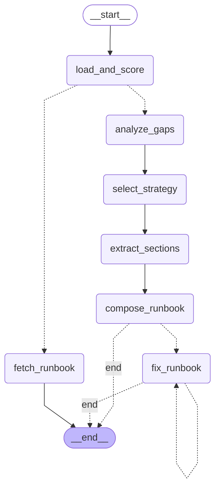
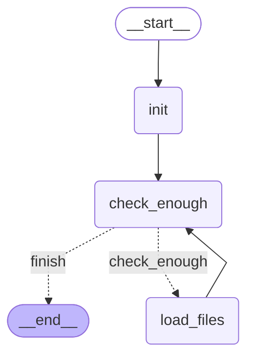

# Phase 1 LangGraph Visualization

## Overview

Phase 1 consists of two interconnected graphs:
1. **Main Phase 1 Graph** - Orchestrates runbook matching or composition
2. **SkillsIR Retrieval Graph** - Progressive context retrieval (used by composition nodes)

## Main Phase 1 Graph



### Node Descriptions

| Node | Type | Description |
|------|------|-------------|
| `load_and_score` | Deterministic | Loads runbook index, calculates match scores, determines confidence level |
| `fetch_runbook` | Deterministic | Fetches matched runbook with WikiLink expansion (HIGH/VERY_HIGH confidence) |
| `analyze_gaps` | LLM + SkillsIR | Identifies gaps between alert and best match |
| `select_strategy` | LLM + SkillsIR | Chooses composition strategy and source runbooks |
| `extract_sections` | LLM + SkillsIR | Extracts relevant sections from source runbooks |
| `compose_runbook` | LLM + SkillsIR | Composes final runbook from extractions |
| `fix_runbook` | LLM + SkillsIR | Fixes validation errors (up to 2 retries) |

### Routing Logic

**After `load_and_score`:**
- HIGH/VERY_HIGH confidence → `fetch_runbook` (match path)
- MEDIUM/LOW/VERY_LOW confidence → `analyze_gaps` (composition path)

**After `compose_runbook`:**
- Validation passes → END
- Validation fails → `fix_runbook`

**After `fix_runbook`:**
- Validation passes → END
- Validation fails + retries < 2 → `fix_runbook` (loop)
- Validation fails + retries >= 2 → END (return best effort)

## SkillsIR Retrieval Graph

Each composition node (analyze_gaps, select_strategy, extract_sections, compose_runbook, fix_runbook) uses this retrieval graph internally via `execute_substep()`.



### SkillsIR Node Descriptions

| Node | Description |
|------|-------------|
| `init` | Load skill registry, file trees, and SKILL.md for initial skills |
| `check_enough` | LLM decides if context is sufficient or needs more files |
| `load_files` | Load requested files with WikiLink expansion |

### SkillsIR Loop

1. `init` loads SKILL.md files for initial skills (e.g., runbooks-manager, cybersecurity-analyst)
2. `check_enough` asks LLM: "Do you have enough context?"
3. If no: LLM requests up to 3 files → `load_files` loads them → back to `check_enough`
4. If yes: → END (return accumulated context)
5. Max 5 iterations to prevent infinite loops

### Feedback Mechanisms

- **Already Loaded**: Files shown to LLM to avoid re-requesting
- **Files Not Found**: Failed requests shown to LLM for strategy adjustment
- **Token Budget**: LLM sees used/limit tokens to guide retrieval depth

## Combined Flow (Composition Path)

```
Alert Input
    │
    ▼
┌─────────────────┐
│ load_and_score  │  ← Deterministic scoring
└────────┬────────┘
         │ LOW confidence
         ▼
┌─────────────────┐     ┌──────────────────┐
│  analyze_gaps   │ ←── │ SkillsIR Loop    │
│                 │     │ (retrieves refs) │
└────────┬────────┘     └──────────────────┘
         │
         ▼
┌─────────────────┐     ┌──────────────────┐
│ select_strategy │ ←── │ SkillsIR Loop    │
│                 │     │ (retrieves guides)│
└────────┬────────┘     └──────────────────┘
         │
         ▼
┌─────────────────┐     ┌──────────────────┐
│extract_sections │ ←── │ SkillsIR Loop    │
│                 │     │ (retrieves repos)│
└────────┬────────┘     └──────────────────┘
         │
         ▼
┌─────────────────┐     ┌──────────────────┐
│ compose_runbook │ ←── │ SkillsIR Loop    │
│                 │     │ (retrieves fmt)  │
└────────┬────────┘     └──────────────────┘
         │
         ▼ validation
    ┌────┴────┐
    │ passes? │
    └────┬────┘
    yes  │  no
    ▼    ▼
  END   fix_runbook (max 2 retries)
              │
              ▼
            END
```

## Key Configuration

| Parameter | Value | Location |
|-----------|-------|----------|
| MAX_ITERATIONS | 5 | retrieval.py |
| MAX_FILES_PER_REQUEST | 3 | retrieval.py |
| DEFAULT_TOKEN_LIMIT | 50,000 | retrieval.py |
| MAX_FIX_RETRIES | 2 | graph.py |
| LLM Model | claude-sonnet-4-20250514 | run_langgraph_real.py |

## System Prompt

All LLM calls use the same system prompt (from workspace.py):
```
"Expert Cyber Security Analyst specialized in creating comprehensive
runbooks from security alerts"
```
